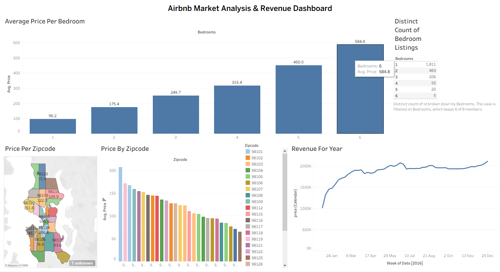

# Airbnb Data Analytics & Visualization Portfolio

An end-to-end data analytics project focused on analyzing Airbnb listing data, tracking revenue trends, evaluating pricing fluctuations by regional zip codes, and identifying performance insights across different property sizes. 

## 📊 Project Dashboards & Visualizations

### 1. Full Interactive Dashboard Overview

---

### 2. Annual Revenue Analysis
*Tracks total revenue growth and booking performance over the year.*

---

### 3. Price Variations by Region & Zip Code
*Geographical pricing breakdown to highlight peak, high-value real estate clusters.*

---

### 4. Bedroom Metrics & Volume Analysis
*Analysis evaluating average price points and available listing volumes segmented by the number of bedrooms.*

---

## 💾 About the Dataset
* **Source Dataset:** `Air bnb dataset.xlsx` (46.01 MB)
* **Tableau Source File:** `AirBnB Full Project.twbx`

*Note: Due to the 46MB size of the source Excel file, GitHub's browser preview is disabled. To view the raw data underlying these visualizations, please click the `Air bnb dataset.xlsx` file above and select the **Download** or **Download Raw** option.*

## 🛠️ Tools Used
* **Data Cleansing & Structuring:** Microsoft Excel / Python
* **Data Visualization & Dashboard Design:** Tableau Desktop
