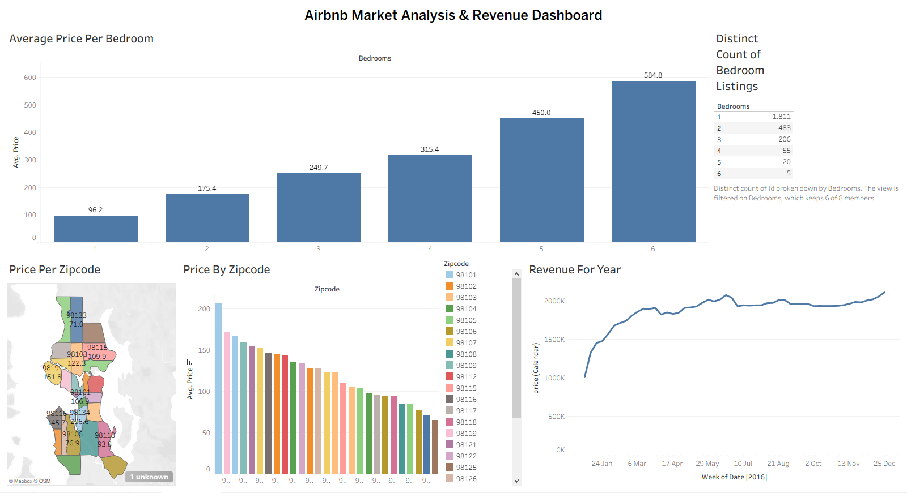

# Airbnb Data Analytics & Visualization Portfolio

An end-to-end data analytics project focused on analyzing Airbnb listing data, tracking revenue trends, evaluating pricing fluctuations by regional zip codes, and identifying performance insights across different property sizes. 

---

## 📊 Project Dashboards & Visualizations

### 1. Full Interactive Dashboard Overview

---

### 2. Annual Revenue Analysis
*Tracks total revenue growth and booking performance over the year.*

---

### 3. Price Variations by Region & Zip Code
*Geographical pricing breakdown to highlight peak, high-value real estate clusters.*

---

### 4. Bedroom Metrics & Volume Analysis
*Analysis evaluating average price points and available listing volumes segmented by the number of bedrooms.*

---

## 📈 Key Insights & Data Findings

Based on the exploratory data analysis and Tableau dashboard telemetry, the following business insights were uncovered:

* **Revenue Seasonality:** Revenue exhibits an upward trajectory starting from Q1, peaking significantly during the summer months (May–August) before stabilizing toward the end of the calendar year.
* **Geographical Pricing Hotspots:** Premium pricing is heavily concentrated in specific urban clusters. Zip codes such as **98101** and **98119** command the highest average prices ($150–$200+ per night), representing prime real estate locations.
* **Inventory Distribution vs. Pricing Power:** 1-bedroom and 2-bedroom listings dominate market volume, making up over **80% of total inventory**. However, larger properties (5 to 6 bedrooms) exhibit exponential pricing leverage, peaking at an average of **$584.8 per night**.

---

## 🛠️ Tools & Technical Workflow

This project utilizes a structured modern data analytics stack to ingest, clean, and visualize data:

### 1. Data Cleaning & Engineering (SQL / Python / Excel)
* **Standardization:** Filtered, structural formatting, and deduplication of records to maintain referential integrity.
* **Handling Nulls:** Identified and eliminated missing inputs or structural anomalies within critical dimensions like `Zipcode` and `Bedrooms`.
* **Aggregation:** Derived baseline metrics such as *Average Price per Bedroom* and *Distinct Listings Count* to optimize data engine performance before visualization.

### 2. Data Visualization & Executive Reporting (Tableau Desktop)
* Developed a cohesive, executive-facing dashboard focusing on visual hierarchy, intuitive color grading for heatmaps, and clean geographical projections.
* Structured dynamic line charts for time-series forecasting and breakdown bar graphs for cross-sectional market size analysis.

---

## 💾 About the Dataset
* **Source Dataset:** `Air bnb dataset.xlsx` (46.01 MB)
* **Tableau Source File:** `AirBnB Full Project.twbx`

*Note: Due to the size of the source file, GitHub's browser preview may be disabled. To view or audit the raw data underlying these visualizations, please click the dataset file within this repository and select the **Download** option.*
