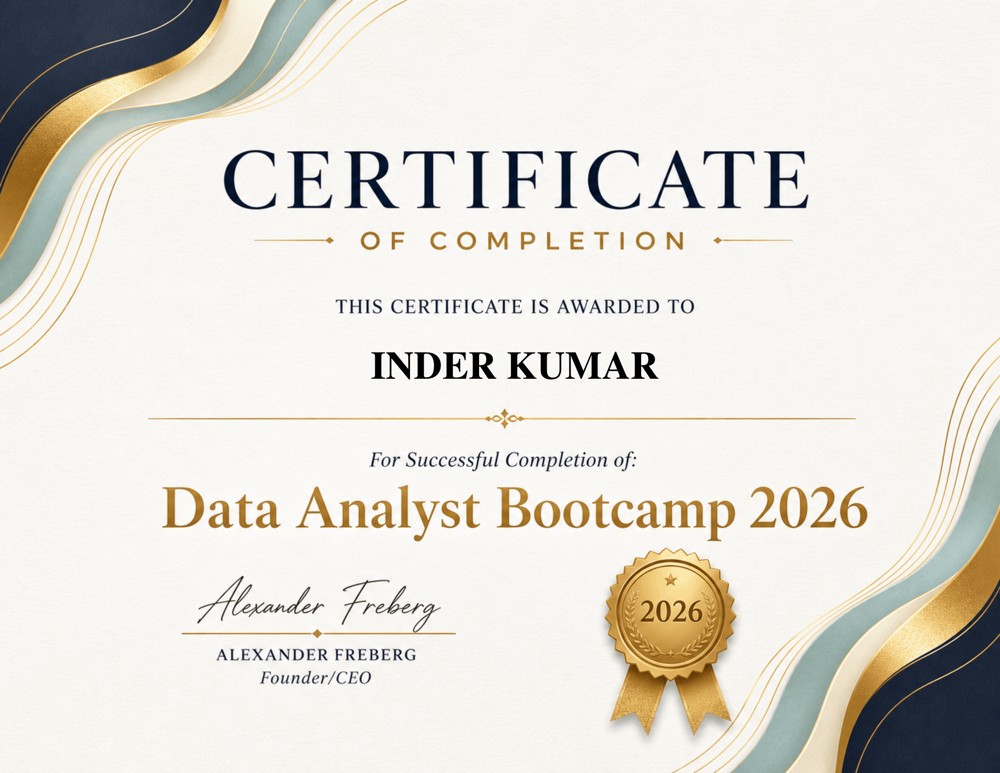

# 🏆 Data Analyst Professional Portfolio

Welcome to my data analytics portfolio showcase. Here, I document end-to-end data analysis projects, business intelligence dashboards, and data-driven insights.

## 🎖️ Professional Certification

---

## 📁 Portfolio Projects Overview

Below is a detailed breakdown of the analytical infrastructure, dashboards, and strategic business data repositories featured in this portfolio:

| 📂 Project Folder | 🛠️ Tech Stack | 📊 Business Insights Focus |
| :--- | :--- | :--- |
| 🎥 **[Global-YouTube-Statistics](./Global-YouTube-Statistics)** | Python (Pandas/Seaborn), Power BI | Global audience scaling metrics, geographic content hotspots, traffic density vs. revenue elasticity, and advanced DAX visualization reporting. |
| 🚀 **[Airbnb-Project](./Airbnb-Project)** | Tableau, Excel / Python | Time-series revenue seasonality, geographic zip-code heatmaps, and pricing power elasticity analysis. |
| ☕ **[Coffee-Shop-Analysis](./Coffee-Shop-Analysis)** | Tableau | Hourly sales velocity matrices, hourly customer traffic spikes, and generational age cohort profiling. |
| 📈 **[Sales-and-Procurement-Analysis](./Sales-and-Procurement-Analysis)** | Power BI | Profitability velocity mapping, unit sales trajectory, and production cost vs. price optimization. |
| 🎵 **[Spotify-Data-Analytics](./Spotify-Data-Analytics)** | SQL, Python / Pandas | Audio engineering metrics correlation, artist track data modeling, and streaming metrics analytics. |
| 📊 **[Data-Professional-Survey-Analysis](./Data-Professional-Survey-Analysis)** | Python, Pandas, Tableau | Data-driven demographic insights profiling the global data analyst career spectrum and compensation variables. |
